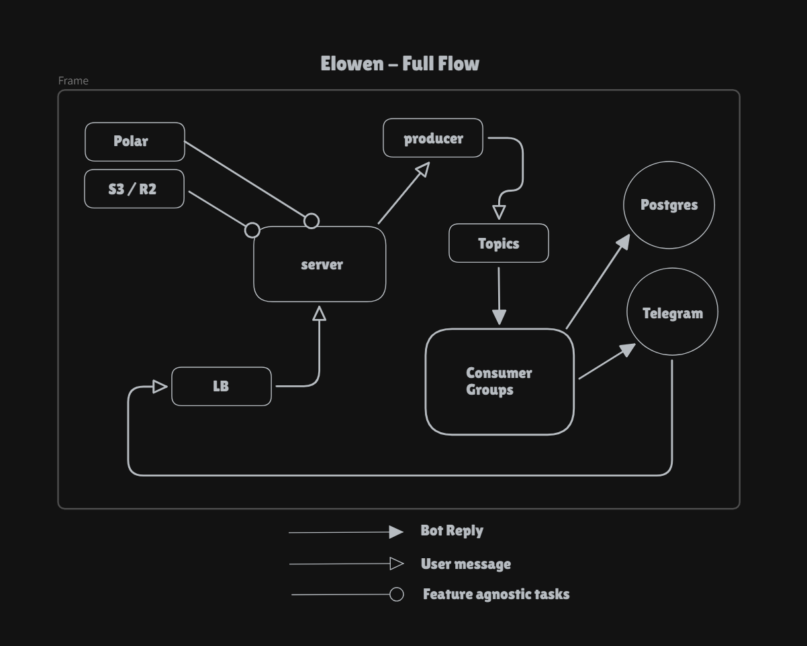

# Elowen

Elowen is a chill AI chat app that lives right inside Telegram. No switching tabs, no extra apps, just message the bot and get smart replies instantly. It is built as a TurboRepo monorepo and is designed to feel more like chatting with a real assistant than using a typical bot.

This project is basically the Telegram-native version of `T3 Chat`.

## System Diagram



## What It Uses

- Telegram Widget for authentication
- Polar for payments
- Kafka for queues and background jobs
- `shadcn/ui` for UI building blocks
- Bun as the package manager and runtime
- TurboRepo for the monorepo setup
- OpenRouter for model access
- Prisma + Postgres for the database layer
- Redis for caching AI context
- Arcjet with a dynamic sliding window strategy for rate limiting

## How To Use

This monorepo uses Bun for installing dependencies and running the project.

```bash
bun install
```

Start everything in development:

```bash
bun run dev
```

Useful commands:

```bash
bun run build
bun run lint
bun run check-types
bun run db:generate
bun run db:migrate
```

## Monorepo Structure

### Apps

- `apps/web` - web dashboard and product surface
- `apps/worker` - background workers and async job processing

### Packages

- `packages/bot` - Telegram bot logic
- `packages/ai-service` - AI orchestration and model-facing logic
- `packages/kafka` - queue and event plumbing
- `packages/cache` - Redis caching layer
- `packages/db` - Prisma and database access
- `packages/ui` - shared UI components

## Why Elowen

Elowen focuses on making AI feel native to Telegram. Instead of asking users to install another app or keep a browser tab open, the experience stays inside the chat interface they already use every day.
